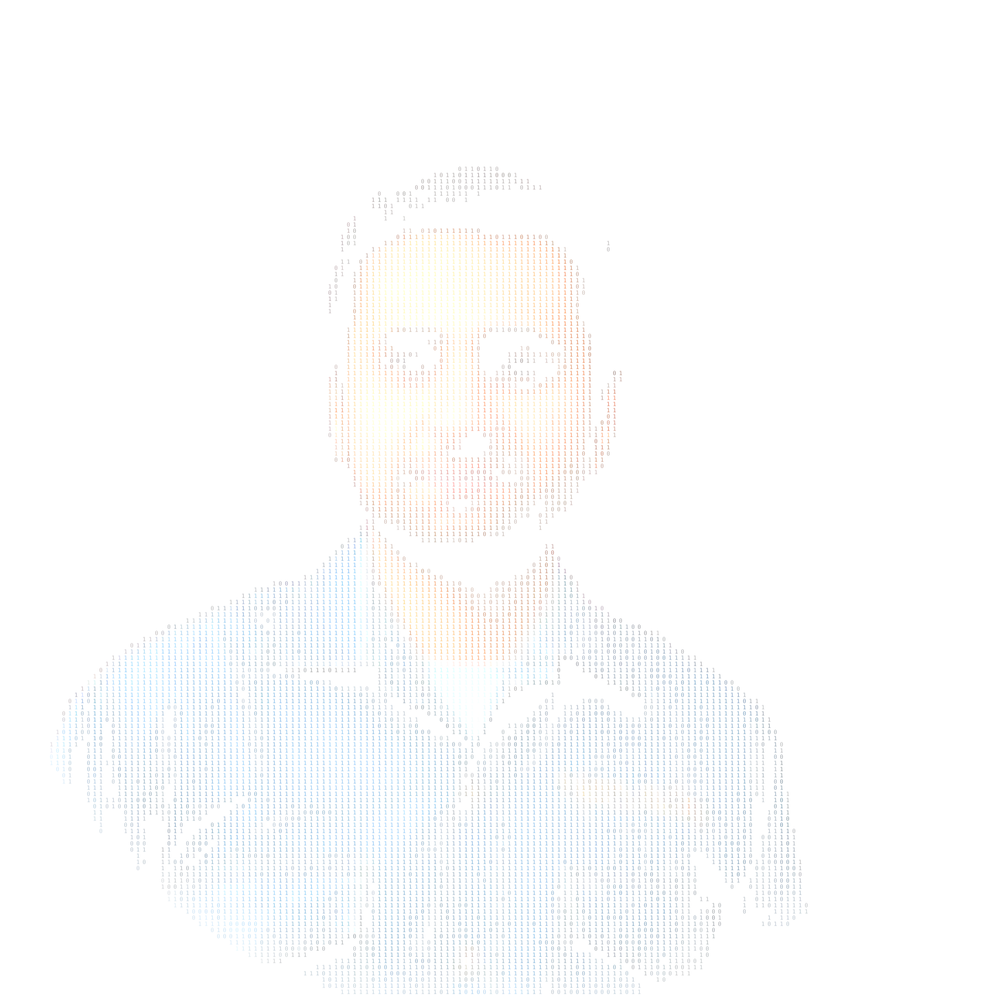

  <h1>Hi, I'm Aditya Chauhan 👋</h1>
  
    

  <h3>Final Year CSE Student @ NITJ | Ex-AEH Intern @ Accenture</h3>
  
<b>Open to - full-time SDE roles, 2027 | Winter Intern role 2027(Jan - June)</b>

  

    
  

  

    &nbsp;&nbsp;&emsp;&emsp;&emsp;&nbsp;
  

 
---

## 
`~/what_i_built`

<table width="100%">
  <tr>
    <td width="50%" valign="top">
      <h3><b><a href="https://github.com/0xAditya-Labs/SwiftCache">SwiftCache</a></b></h3>
      
<b>15,000+ QPS | &lt;3ms p99 latency</b>

      
Thread-safe TCP-based concurrent LRU cache server supporting deterministic <b>O(1)</b> operations.

      <code>C++</code> <code>TCP/HTTP</code> <code>Concurrency</code>
    </td>
    <td width="50%" valign="top">
      <h3><b><a href="https://github.com/0xAditya-Labs/My-Chat-App">Chatty</a></b></h3>
      
<b>0% observed message loss | &lt;50ms latency @ 500+ clients</b> <b><a href="https://github.com/0xAditya-Labs/My-Chat-App">[Live Link]</a></b>

      
Full-stack distributed messaging platform — React UI to Redis Pub/Sub backbone. Hardened multi-tab presence state.

      <code>MERN</code> <code>Socket.io</code> <code>Redis</code> <code>JWT</code>
    </td>
  </tr>
  <tr>
    <td width="50%" valign="top">
      <h3><b><a href="https://github.com/0xAditya-Labs/ContextIQ">ContextIQ</a></b></h3>
      
<b>34% token usage reduction | 69% latency slash</b> <b><a href="https://context-iq-frontend-seven.vercel.app/">[Live Link]</a></b>

      
LangGraph ReAct agent with docstring tool-gating and thread-safe ChromaDB client tracing via OpenTelemetry.

      <code>LangGraph</code> <code>ChromaDB</code> <code>OpenTelemetry</code>
    </td>
    <td width="50%" valign="top">
      <h3><b><a href="https://github.com/0xAditya-Labs/ISP-Customer-retention-Recommender">RetainOps</a></b></h3>
      
<b>63.8% revenue-at-risk captured</b>

      
AI-Powered Customer Retention Platform deploying production-ready ML inference across tuned classifiers.

      <code>React</code> <code>FastAPI</code> <code>Scikit-learn</code> <code>SHAP</code>
    </td>
  </tr>
</table>

 
---

## 
`~/algorithmic_engine`

### `/algorithmic_coding_competitions`
<ul>
  <li><b>Meta Hacker Cup:</b> Advanced to Round 2, securing Global Rank 3223 (AIR 875) out of thousands of competitors.</li>
  <li><b>Flipkart GRiD:</b> Semi-Finalist in 7.0 and 8.0 (consecutive years), placing in the top 0.5% among 3.2 lakh+ participants.</li>
  <li><b>CodeStorm:</b> Secured 2nd place in GDSC NIT Jalandhar's competitive programming contest.</li>
</ul>

### `/coding_profiles`
<!-- STATS:START -->
<ul style="list-style-type: none; padding-left: 0;">
  <li>
    &nbsp;
    <b>LeetCode</b> -- Knight (Max Rating: 1965)&nbsp;
    
  </li>
   
  <li>
    &nbsp;
    <b>Codeforces</b> -- Specialist (Max Rating: 1418)&nbsp;
    
  </li>
   
  <li>
    &nbsp;
    <b>CodeChef</b> -- ★★★ (Max Rating: 1661)&nbsp;
    
  </li>
</ul>
<!-- STATS:END -->

 
---

<!-- ## 
`~/stats`
 -->

<!-- FUTURE:STATS_RADAR:START -->
<!-- FUTURE:STATS_RADAR:END -->

<!-- 
 -->
  <!--  -->
  <!--  -->
<!-- 
 -->

<!--   -->
<!-- --- -->

## 
`~/about_me`

  

 

I build complete systems, not isolated features — I'm equally comfortable optimizing what happens at the OS/memory layer and what a user actually clicks on. My focus stays on the boundary most people skip: what makes a system correct <i>and</i> fast under real concurrent load, not just correct in a demo.

<ul>
  <li>🎓 <b>Education:</b> B.Tech in CSE @ NIT Jalandhar, Final Year</li>
  <li>💼 <b>Experience:</b>
    <ul>
      <li>Ex - Software Engineer Intern @ <a href="https://www.accenture.com/in-en">Accenture</a>, Bangalore (May-Aug 2026)</li>
      <li>CP Team Lead @ <a href="https://gdg.community.dev/gdg-on-campus-dr-b-r-ambedkar-national-institute-of-technology-jalandhar-jalandhar-india/">Google Developer Group, NITJ</a></li>
    </ul>
  </li>
  <li>🧠 <b>Obsessions:
  <ul>
      <li>DSA & CP, competitive-programming-grade problem solving</li>
      <li>Systems that don't lie to users under load — correctness under concurrency, not just happy-path demos</li>
      <li>AI tools that remove friction, not thinking — no LLM-wrapper shipping</li>
    </ul>
  </li>
  <li>⚡ <b>Fun Fact:</b> I love bridging the gap between high-level architectural abstractions and low-level system execution. I believe the best engineers can dive deep into the OS layer to get the backend system optimized just as easily as they build the client-facing UI effciciently yet in quick agile way.</li>
</ul>

 
---

## 
`~/the_human`

I’m a nerd at heart — I love **maths and physics** just as much as I love coding and technology. I enjoy going down **research rabbit holes**, and when I’m not building something, there’s a good chance I’m **drawing** — usually a Pokémon, because apparently that’s my default creative mode.

Outdoors, I’m usually playing **badminton or swimming**. Indoors are reserved for **dancing, cracking jokes, doing deep and fun conversations, or occasionally writing stories**. I somehow keep ending up in situations where people hand me responsibility, so I’ve learned to enjoy **taking ownership, bringing people together, and making sure things actually get done**.

And when it’s time to switch off, you’ll probably find me somewhere in the **MCU or an anime universe**. That’s all part of the lore.

   
  <i>Jai Parmatma</i> 🪈🦚

